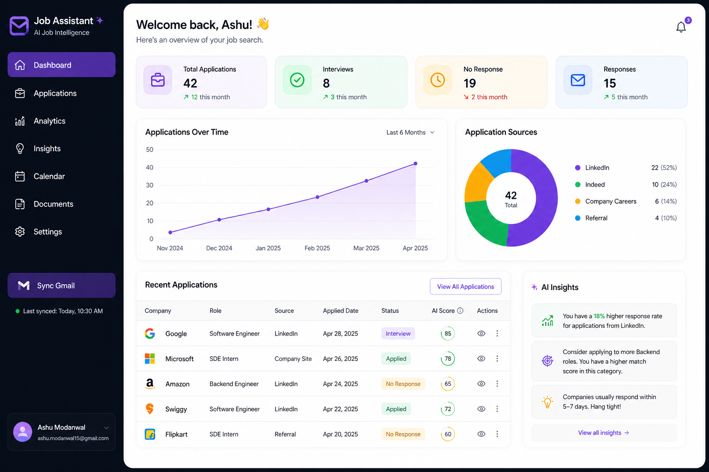
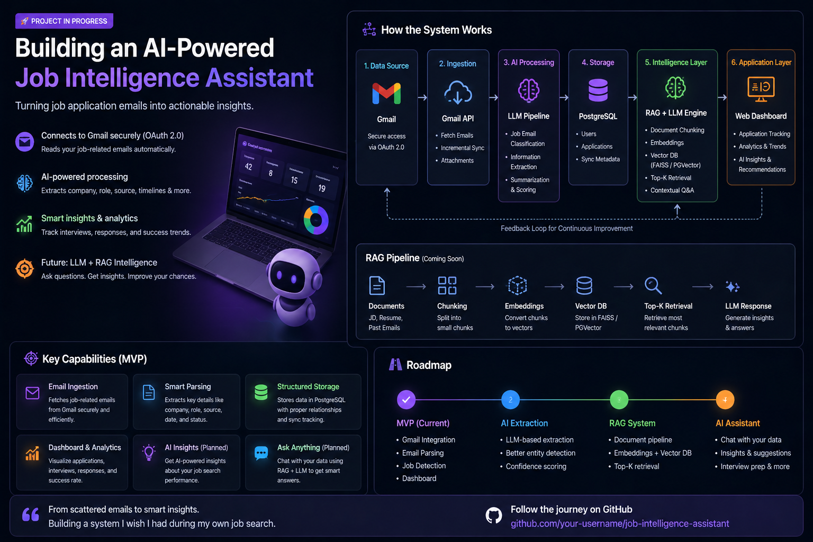
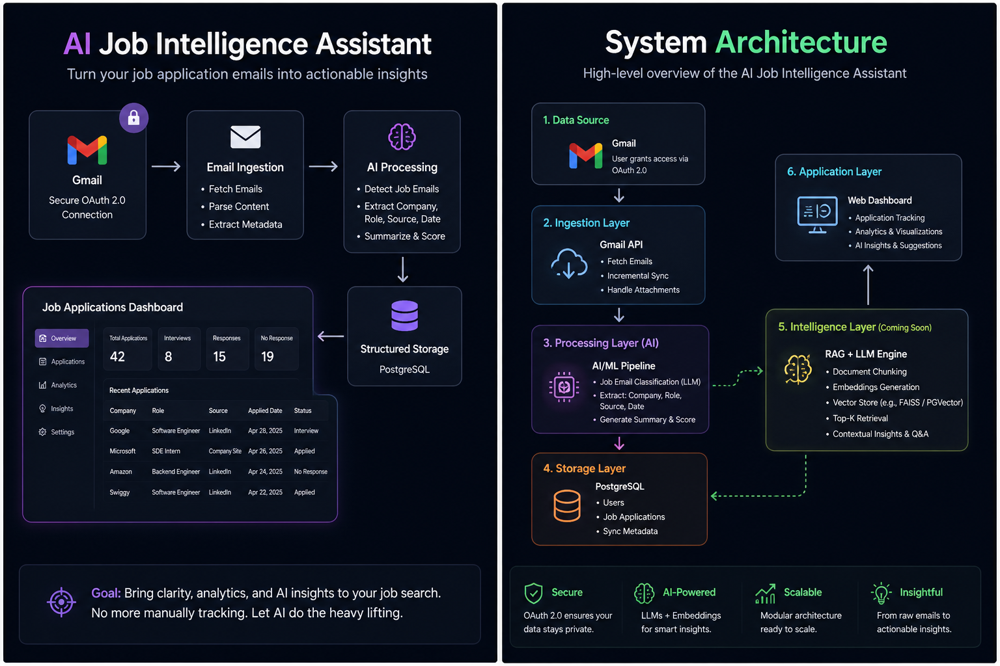

# 🚀 AI-Powered Job Intelligence Assistant

> Transforming unstructured job emails into **actionable intelligence using AI + RAG**

---

## 🧩 Problem

Like many developers, I applied to multiple companies across platforms — LinkedIn, Indeed, company portals…

But the real problem wasn’t applying.

- ❌ Losing visibility after applying
- ❌ Not knowing where I applied
- ❌ Not understanding why I’m not getting responses

👉 The data already exists — buried inside **Gmail**, but completely unstructured.

---

## 💡 Solution

This project builds an **AI-powered system** that:

- 📩 Extracts job-related data from emails
- 🧠 Converts unstructured content → structured intelligence
- 🗄️ Stores it in a queryable system
- 🤖 Uses **RAG (Retrieval-Augmented Generation)** to generate insights

---

## 📊 Dashboard (Current MVP)

A centralized dashboard to track:

- Applications
- Status (Applied / Rejected / Interview)
- Companies & Roles
- Timeline insights

---

## ⚙️ Current System (MVP)

### 🔧 Features

- 🔐 Google OAuth 2.0 authentication
- 📩 Gmail API integration (email ingestion)
- 🧠 Parsing engine (extract company, role, source, date)
- 🗄️ PostgreSQL for structured storage
- 🔄 Sync-based architecture (idempotent, no duplicates)

---

### 🔄 Pipeline

---

## 🧠 AI Layer (In Progress)

This is where the system evolves from **tracking → intelligence**

---

### 🧩 Core AI Components

#### 1. Document Processing
- Emails (application confirmations, rejections, updates)
- Job Descriptions (JD)
- Resume

#### 2. Chunking Strategy
- Splitting large documents into smaller chunks
- Maintaining semantic continuity

#### 3. Embedding Generation
- Convert text → vector representations
- Captures semantic meaning beyond keywords

#### 4. Vector Database
- FAISS / PGVector
- Efficient similarity search

#### 5. Retrieval (Top-K)
- Fetch most relevant chunks for a query

#### 6. LLM Reasoning Layer
- Combines retrieved context
- Generates intelligent, contextual answers

---

## 🔍 RAG Pipeline (Core Idea)

---

## 🤖 What This System Enables

Instead of just tracking applications, this system can answer:

- ❓ Why am I not getting callbacks?
- 📉 Which skills are missing across applications?
- 🎯 Which roles am I best suited for?
- 🧠 How can I improve my resume for a specific job?

---

## 🧱 Full System Architecture

---

## 🧪 Tech Stack

### Backend
- Java + Spring Boot
- REST APIs
- Gmail API

### Data Layer
- PostgreSQL
- (Upcoming) PGVector

### AI Layer (Upcoming)
- Embeddings (OpenAI / Local LLMs)
- FAISS / Vector DB
- RAG Pipeline

---

## 🔥 Vision

Move from:

❌ Passive job tracking

To:

🚀 **AI-driven job decision system**

---

## 📌 Future Enhancements

- 📊 AI-powered job match scoring
- 🧠 Resume vs JD gap analysis
- 📬 Smart follow-up recommendations
- ⚡ Event-driven architecture (Kafka)
- 🏗️ Scalable microservices architecture

---

## 🙌 Why This Project Matters

This is not just a CRUD project.

It combines:

- Backend Engineering
- AI System Design
- Distributed Thinking
- Real-world Problem Solving

---

## ⭐ Final Thought

> Your job search already has data.  
> This system turns it into intelligence.